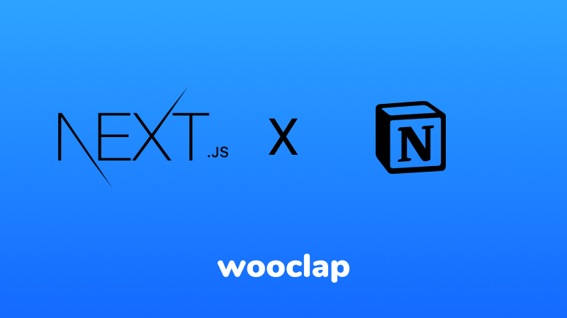
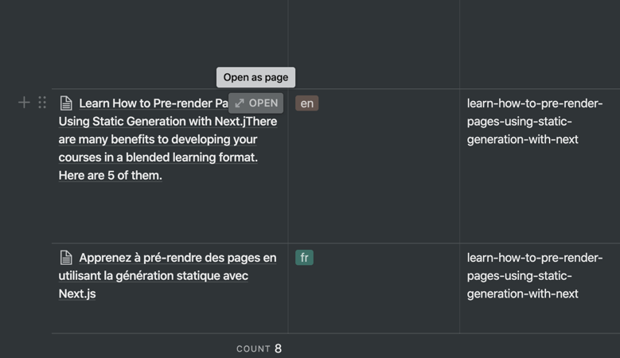

# Notion Starter Blog



[View the live demo](https://notion-starter.vercel.app/) • [Edit in the CMS](https://www.notion.so/arnaudjnn/d0aa40bcd23249c7a772aeaea62abdd0?v=f5d37922782e44fbaa232836e99456df)

This starter is designed for flexibility. Using it, you'll be able to manage your blog content entirely in Notion, and get a Next app automatically generated. Marketing teams will be able to create new articles without help from developers.

This blog features:

- Articles creation within Notion, no code necessary
- Fully flexible page structure: use Notion blocks [listed here](https://github.com/splitbee/react-notion#supported-blocks).
- 3 UI Sections out of the box: Hero, Blog index and Blog read.
- Easy to theme with [Chakra](https://next.chakra-ui.com/)
- Static site generation and [Incremental Static Regeneration](https://nextjs.org/docs/basic-features/data-fetching#incremental-static-regeneration) with Next

## Prerequisites

[Yarn](https://yarnpkg.com/en/) or [NPM](https://nodejs.org/)

## Getting started

The easiest way to try this starter is to run it locally on your computer.

Install dependencies and run your server:

```bash
# Using yarn
yarn install
yarn develop

# Using npm
npm install
npm run develop
```

The Next.js server will run here => [http://localhost:3000](http://localhost:3000)

## Adding Articles

1. Go to the Notion blog index page: [Blog](https://www.notion.so/arnaudjnn/d0aa40bcd23249c7a772aeaea62abdd0?v=f5d37922782e44fbaa232836e99456df)
2. Add a new line in the table and use ```Open as a page``` as follow:

3. Write content using Notion awesome experience, automatically saved. Don't forget to fill all the attributes in the table. ```published``` check is required to publish the content.
4. To create a CTA. Add the followng code in your article where you want to display it:
```{{ <Button href="/my-link" variant="primary">Contact us<Button/>}}```

> 💡 With Next.js Incremental Static Regeneration awesome new feature, you get the best of the both worlds: static website without build time! Write you article and you're good to go!

## Custom theme

We use Chakra for styling. To modify your page's look, you can edit the theme in `/theme.js`. Read the [Chakra docs](https://next.chakra-ui.com/docs/theming/theme) to view all the changes you can make. For example, you can change the primary color like this:

```jsx
export default {
  colors: {
    primary: 'gold',
    secondary: '#1D254F',
    grey: {
      100: '#E7EBF0',
      200: '#FAFAFA',
      300: '#8A8AA3'
    }
    // ...
  },
}
```
## Deploying to production

[Deploy Next.js](https://nextjs.org/docs/deployment)

Have fun using Notion as a Healdess CMS, you're Marketing team will thank you!
