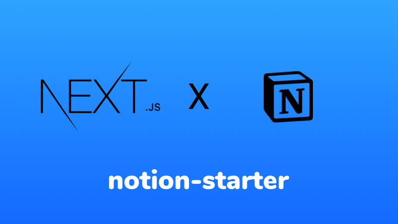

# Wooclap Blog

[View the live demo](https://blog-wooclap.vercel.app/en/blog) • [Edit in the CMS](https://www.notion.so/arnaudjnn/d0aa40bcd23249c7a772aeaea62abdd0?v=f5d37922782e44fbaa232836e99456df)

This starter is designed for flexibility. Using it, you'll be able to manage your blog content entirely in Notion, and get a Next app automatically generated. Marketing teams will be able to create new articles without help from developers.

This blog features:

- Articles creation within Notion, no code necessary
- Fully flexible page structure: use Notion block listed here.
- 2 UI Sections out of the box: Hero, Contact.
- Easy to theme with [Chakra](https://next.chakra-ui.com/)
- Static site generation and [Incremental Static Regeneration](https://nextjs.org/docs/basic-features/data-fetching#incremental-static-regeneration) with Next

## Prerequisites

[Yarn](https://yarnpkg.com/en/) or [NPM](https://nodejs.org/)
